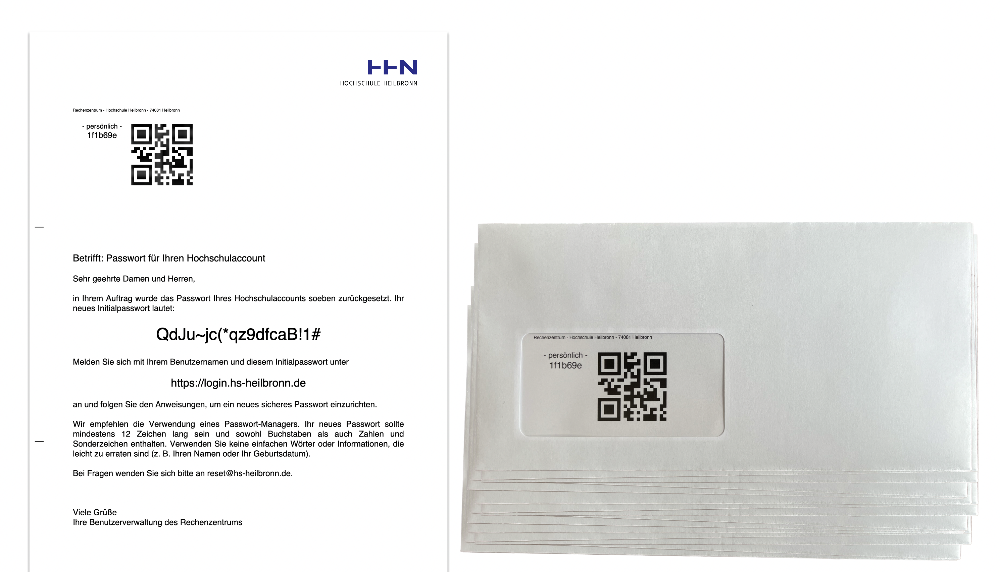

# SSO Helpdesk

The Helpdesk application supports password resets at Heilbronn University.

The Helpdesk application is connected to our identity management and single sign-on system based on Keycloak. The setup of this environment is described in more detail in the [sso-docs](https://github.com/HHN/sso-docs) repository.

## Motivation

In the past, when university members had problems accessing their university account, they went to the helpdesk to have their account reset. They then configured their new password directly on the helpdesk operator's keyboard. This causes several problems:

1) Users are unable to configure a strong and secure password in such a situation, including being unable to use their password manager properly.

2) Users are also unable to set up a second factor, either via TOTP or FIDO2.

3) In some cases, helpdesk staff have generated random passwords (e.g., Summer 2023!) and issued them using Postit Notes.

We needed a better solution, which we are now making available to other organisations as open source. We also used this application when we issued more than 10,000 new passwords following a cyber attack and support volumes had increased. With our solution, we were able to resolve support cases faster and provide a more secure approach to password resets.

## Solution

We developed our own Helpdesk application. The application pre-generates password reset letters with random passwords. These letters are printed and made available in envelopes at the helpdesk.



In the viewing window there is a QR code with a sequential number. Once the identity of a person has been established (ID check), the relevant user account is selected via the Helpdesk application and then the QR code is scanned.

At this point, the account is reset to the password contained in the letter. For this, the application communicates using the Keycloak API. An audit log of all activity is created so that at the end of the day the signature lists in the helpdesk offices can be compared to the audit log of documented password resets.

Note that in our setup, Keycloak uses the university's Windows Active Directory (AD) as its single source. This approach allows us to reset those AD user accounts, give them a random password and force them to change their password the next time they log on.

## Limitations

The application was originally intended to be used only for the initial password rollout, but is now in permanent use. This is why there is no permissions management or role model implemented yet. At the moment, any helpdesk employee can reset any AD account. So far, we have taken organisational measures to prevent misuse by only allowing selected employees to access the application and by keeping an audit log. However, we are planning to implement a role model function in the near future, so that, for example, IT staff in remote locations can reset the passwords of students in their respective faculties.


# Developer Docs

## Update `git submodules`

You can update the associated submodules by using

```bash
git submodule update --remote
```

## Overriding application properties

To run the Helpdesk application, you have to override properties defined in `application.properties`.
To do so, you can adjust them as needed in the `docker-compose.yml`.

## Building behind a proxy

To run the docker build behind a web proxy, you can run

```bash
docker compose build --build-arg "HTTP_PROXY=$HTTP_PROXY" --build-arg "HTTPS_PROXY=$HTTPS_PROXY" --build-arg "http_proxy=$HTTP_PROXY" --build-arg "https_proxy=$HTTPS_PROXY" --no-cache
```

to build the docker images accordingly.

# Installation

- Clone this repository. Ideally, use the latest available released version by running

```bash
git clone --branch <TAG_NAME> git@github.com:HHN/sso-helpdesk.git
```

Note: By default, the repository is set up for ssh-based git operations. If you are forced to use http-based git operations, you need to adjust `.gitmodules` accordingly.

- Adjust the values in `docker-compose.yml` according to your needs, ie specify the necessary client ids and client secrets as well as the realm configuration of your `helpdesk` and `target` realms.
- Update the nginx configuration in [nginx](nginx) accordingly, ie
  - Add a valid SSL/TLS certificate
  - Adjust the full qualified domain name in the nginx configuration
- Run

```bash
docker compose build --no-cache; #if behind a proxy, you need to adjust this command as mentioned in the developer docs
docker compose up -d;
```